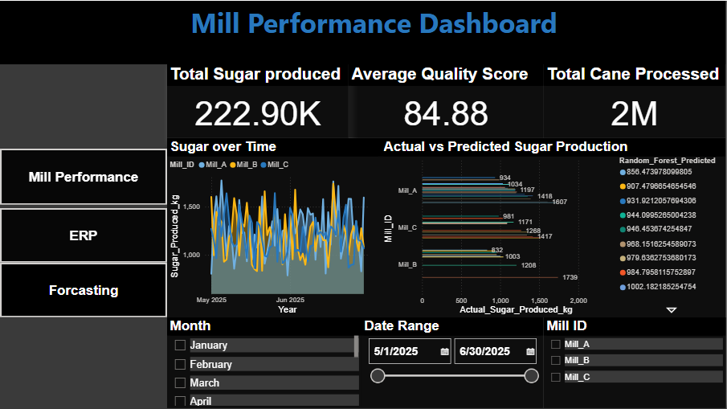
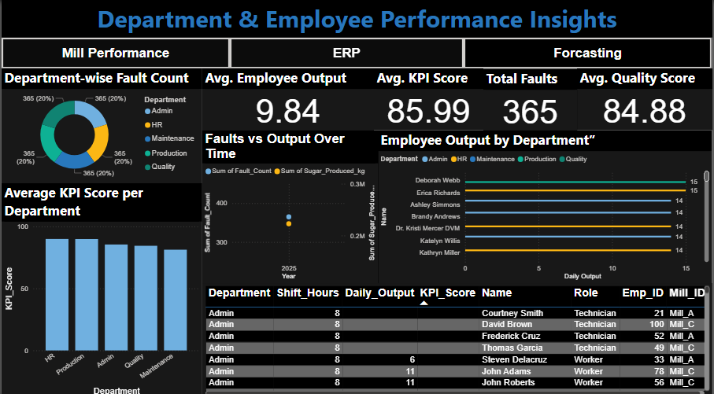

# 🏭 Sugar Mill Power BI Dashboard

A business intelligence dashboard created using Power BI to visualize and analyze the performance of a Sugar Mill — covering production, inventory, sales, and financial KPIs.

## 📊 Key Features:

- 📦 **Production Summary** – Daily/Monthly sugar production trends
- 🏗️ **Inventory Levels** – Real-time stock levels and warehouse analysis
- 💰 **Sales Report** – Client-wise sales, payment status, and outstanding dues
- 🧾 **Expense Overview** – Expense categories and trends over time
- 🔍 **Filters/Slicers** – Dynamic filtering by date, region, mill branch, etc.

## 🛠️ Tools & Technologies

- **Power BI**
- **Microsoft Excel**
- **DAX Measures**
- **Python (for data preprocessing)** *(if applicable)*

## Dasboard shows

